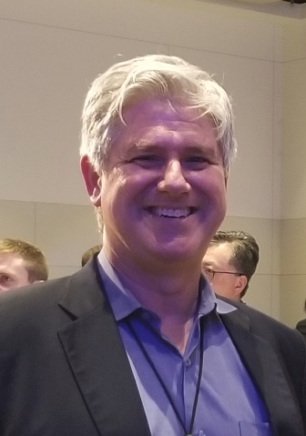
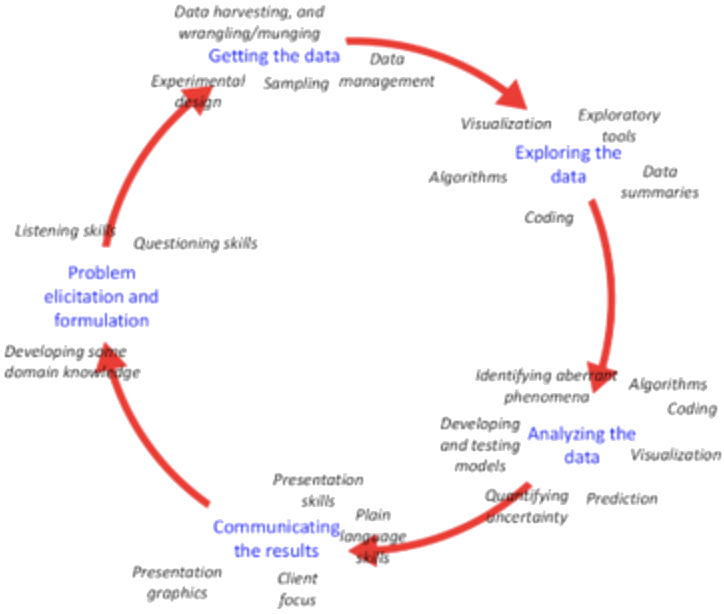

class: inverse

```{r include=FALSE}
library(ggplot2)
filter <- dplyr::filter
knitr::opts_chunk$set(warning=FALSE, message=FALSE, fig.width=10.5, fig.height=4, 
  comment=NA, rows.print=16)
theme_set(theme_gray(base_size = 24))
```

class: inverse

## Talk 1: Alison L. Gibbs (University of Toronto)

<a href="https://www.statistics.utoronto.ca/people/directories/all-faculty/alison-gibbs">
</a>

<br/>

<a href="./alison.pdf">Introduction to the International Data Science in Schools Project</a>

---

class: inverse

## Talk 2: Wesley S. Burr (Trent University)

<a href="http://www.wesleyburr.com">
</a>

<br/>

<a href="./wesley.html">Case Studies in Data Science Education: Limits and Scope</a>

---

class: inverse

## Talk 3: Robert Gould (UCLA)

<a href="http://www.stat.ucla.edu/~rgould/Home/About_Me.html">
</a>

<br/>

<a href="./robert.key">Implementing a Data Science Course in Secondary Schools</a>

---

layout: false
class: inverse, middle

<center>
<a href="http://www.idssp.org/"></a> &emsp;&emsp;
<a href="https://creativecommons.org/licenses/by/4.0/"></a>
</center>

## If you're interested, let us know - we'd love to talk more about this project!

- Contact us: [Email](mailto:idssp.info@gmail.com) or [Twitter](https://twitter.com/idssp1)
- Slides created via the R package [xaringan](https://github.com/yihui/xaringan) by Yihui Xie
- Slides and source at <http://bit.ly/idssp_ssc19>

<br/>
