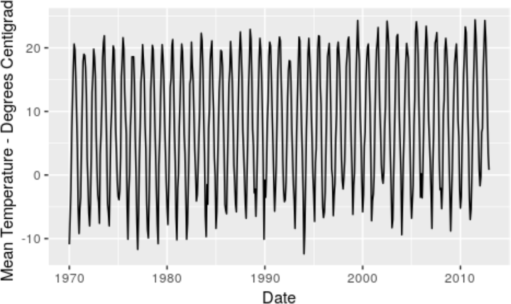
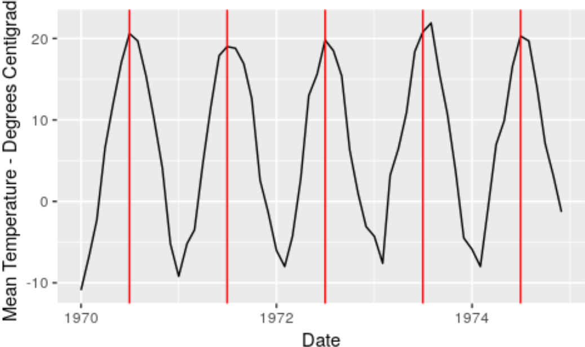
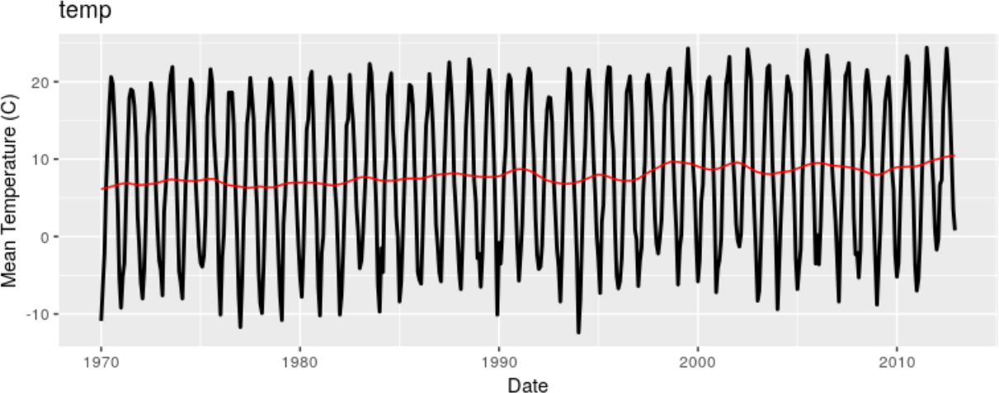
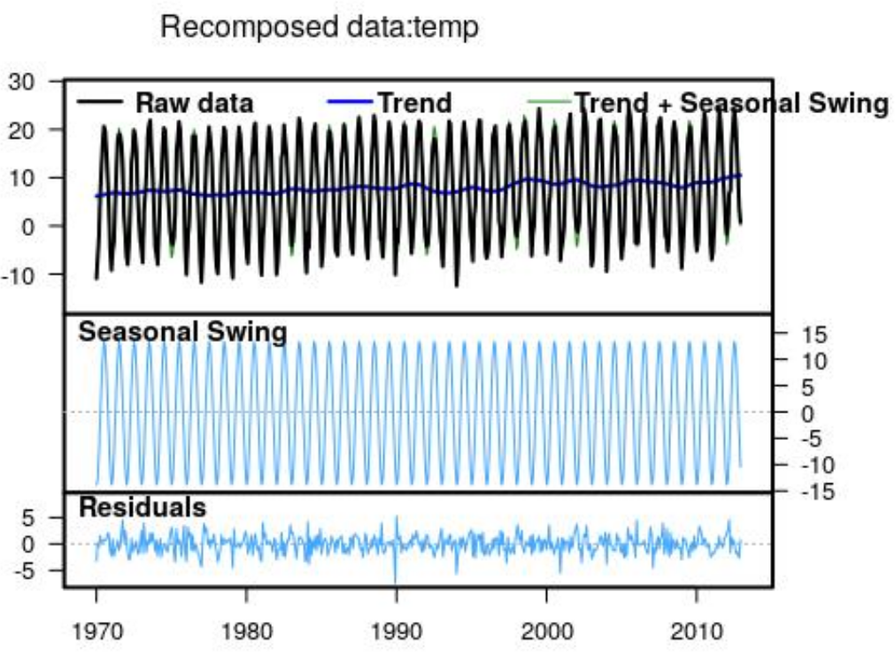
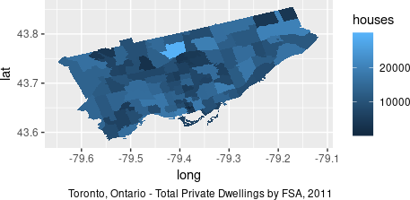
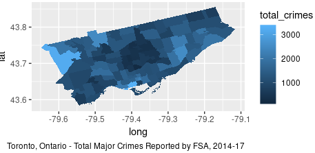
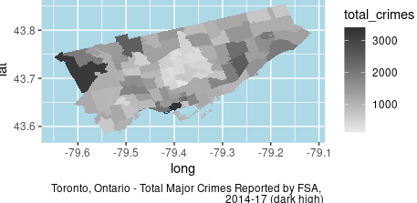
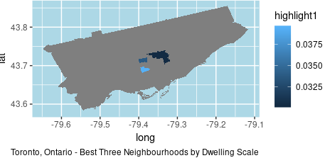

class: inverse

```{r include=FALSE}
library(ggplot2)
filter <- dplyr::filter
knitr::opts_chunk$set(warning=FALSE, message=FALSE, fig.width=10.5, fig.height=4, 
  comment=NA, rows.print=16)
theme_set(theme_gray(base_size = 24))
```

## Two Years

The IDSSP is aimed at a full curriculum framework, computationally agnostic, for a two-year sequence in the final
two years of a traditional "Western" education system. 

<p>
* for North Americans: years 11 and 12 of high school. 
* designed so Year 1 can stand alone (perhaps as a Year 12 standalone course)
* Year 2 flexible, designed to allow for localization and modularity

---

class: inverse

## Year 1

The first year was built to map approximately to a standard curriculum-hour level at the midpoint
of the regions involved (e.g., 120 hours of material).

<p>
* Seven serial topics
* Develop the Data Science Learning Cycle

---

class: inverse

## Breakdown

* Data Science and Me
* Basic Tools for Exploration and Analysis: Part 1 (Single Variable)
* Basic Tools: Part 2 (Pairs of Variables)
* Basic Tools: Part 3 (Three+ Variables)
* Graphs and Tables
* Data Handling Pipeline
* Avoiding being misled by data

---

class: inverse

## Notes

* strong emphasis on reinforcement of the cycle, each sub-unit (1.1 through 1.7)
working through the cycle at least once
* goal of a numerate student body by the conclusion
* integration of ethics, data handling concerns, general societal understanding

---

class: inverse

## Year 2

The second year was designed from the outset to be modular, with more material than might reasonably be
covered in a standard secondary course (e.g., compare with Calculus or capstone Physics in the Canadian
education system).

* Ten parallel topics
* All build on the 7-topic first year
* Minimal interdependency, but many common themes

---

class: inverse


## Advanced Ideas!

The goal with the second year was to present a broad, rather than deep, exposure to models and frameworks
for the analysis of data

* Time Series Data (Statistics)
* Map Data (Hybrid)
* Text Data (Hybrid)
* Supervised Learning (Hybrid)
* Unsupervised Learning (CS)

---

class: inverse

## Advanced Ideas! (ctd.)

* Recommender Systems (CS)
* Interactive Visualization (Hybrid)
* Confidence Intervals and the Bootstrap (Statistics)
* Randomization Tests and Significance Testing (Statistics)
* Image Data (Hybrid)

---

class: inverse

## Composition of Team

Curriculum team was comprised of statisticians and computer scientists,
and the topics selected show that breadth.

<br />

* naturally some push/pull on what should be considered most important
* note that inference made it in via randomization and the bootstrap
(no requirement of distribution theory and probability)
* remember: the *only* pre-requisite for a course based on this material is Unit 1's course!

---

class: inverse

## Case Studies

Three case studies were developed, for the topics:

<br/>

* Time Series Data 
* Map Data 
* Unsupervised Learning (K-Means Clustering)

<br/>
--

Goals?

<br />
* help the *instructors* in deepening understanding of the importance and relevance of topics

---

class: inverse

## Case Study 1: Time Series Data

Time Series Data can be quite complex, even for statistics majors or graduate students - adding the
temporal dependence structure goes quite far afield from independent samples!

---

class: inverse

## What do we want?

* understanding that data exists which has temporal structure
* basic concepts of seasonality and trend (additive only!)
* graphical decomposition methods (e.g., STL) - visual study
* introduction to more complex statistical models than linear or curved regressions

---

class: inverse

## How far can we take students?

(with no understanding of joint distributions, stationarity, or stochastic processes)

<br/>

* preparation of data
* plotting, visualizations
* "click" analysis (trend, seasonality)
* basic "click" forecasting (e.g., Holt-Winters)
* telling stories with data!

---

class: inverse

## What do we want instructors to know?

* all of the above
* where data comes from, awareness of variety
* overall modeling: features, appropriateness of analysis methods
* the data science cycle using time series: what kinds of questions?

---

class: inverse

## Our Case Study

The case study developed for the Time Series module starts, as we 
encourage via the Data Science Cycle, with a question (paraphrased):

<p/>
<br/>

<center><b>
In the context of NASA's statement that 'The world is getting warmer ...
at a rate of 0.15 degrees C per decade since 1975', can we see this in
data from Toronto, Ontario?
</b></center>

---

class: inverse

## Case Study Steps

* load the data
* subset to monthly temperature averages
* plot!

---

class: middle

## Case Study 1: Plot 1




---

class: middle

## Case Study 1: Plot 2



---

class: middle

## Case Study 1: Plot 3



---

## Case Study 1: Plot 4



---

class: inverse

## Case Study Steps

* decompose using a linear fit
* conclude with a linear regression (fit), use slope to answer question

```{r, eval = FALSE}
summary(lm(temp ~ x, data = pearson_df))$coef[2, 1:2]
```
`## Estimate Std. Error`

`## 0.006128419 0.002868623`

---

class: inverse

## Case Study Steps: Notes

Across the decades since 1970, the monthly average temperature in
Toronto shows an increase of $\sim 0.061^\circ$C / decade, or
$\sim 0.0061^\circ$C / year. 

<br />

* smaller than NASA's global estimate
* discussion of why: local versus global
* averaging, heat islands, climate-specific concerns

---

class: inverse

## Case Study Steps: Notes (ctd.)

The case study then concludes by using Holt-Winters to forecast two years
into the future, giving the opportunity to discuss:

<br/>

* accuracy and prediction intervals
* what is shown and what is not (seasonality: yes; perfect prediction: no)

---

class: inverse

## Case Study 2: Map Data

Map data *can* be even more complex than time series data, especially if **models**
are being considered: spatio-temporal models are far too complex for consideration.

Instead, this unit is aimed mostly at visualization!

<br />

* presenting data using maps as the framework
* exploring geographical patterns
* integration of domain-specific knowledge for understanding

---

class: inverse

## Maps Data

* what do we want out of this section?
* how far can we take students who have zero chance of understanding stationarity?
* what do we want instructors to know?

---

class: inverse

## What do we want?

* exposure to the purpose of maps
* coverage of the basic working objects on maps (edges, points, lines, distance)
* some exposure to the concept "the map is not the [data] (territory)"
* additional experience in data processing and manipulation - move to format suitable
for presentation
* additional experience with visualization as a tool for understanding

---

class: inverse

## How far can we take students?

* preparation of data
* plotting, basic visualizations
* overlays
* discussion of aggregation, geographic units (counties, states, voting districts, etc.)
* telling stories with data!

---

class: inverse

## What do we want instructors to know?

* all of the above
* where data comes from, awareness of variety
* ethical concerns with geotagged data, privacy
* the data science cycle using map data: what kinds of questions are appropriate?

---

class: inverse

## Our Case Study

The case study developed for the Map Data module starts, as we 
encourage via the Data Science Cycle, with a question (paraphrased):

<br/>

<center><b>
I live in Toronto, and I need to find a
new place to live. What neighbourhood should I live in to be safest?
</b></center>

---

class: inverse

## Case Study Steps

* introduce students to the geographically localized problem
* ask more questions: refine the primary
* what does it mean to be "safe"?
* what is a "neighbourhood"?
* what city are we in?

<br/>

(for this case study, we did not use any additional criteria, but they would 
make the case study much more interesting!)

---

class: inverse

## Case Study Steps

* get some data!
* Census Data shapefiles for Forward Sortation Areas (post codes) - privacy!
* Toronto OpenData portal 
* Toronto Public Service "Public Safety Data Portal" - major crimes

---

class: inverse

## Case Study Steps

Data manipulation!

* merge multiple data sources
* discuss population weighting: absolute quantities aren't comparable!
* population counts data from Statistics Canada

---

class: middle

## Case Study 2: Plot 1



---

class: inverse

## Case Study Steps

* crime data: what crimes matter? localize them!
* cross-over with Learning topics (Approximate Nearest Neighbours)
* chloropleth with total number of crimes, 2014-2016

---

class: middle

## Case Study 2: Plot 2



---

class: middle

## Case Study 2: Plot 3



---

class: inverse

## Case Study Steps: Making a Decision

* identify best neighbourhoods by score: crimes per dwelling
* visualize top 3 neighbourhoods

---

class: middle

## Case Study 2: Plot 4



---

class: inverse

## Case Study Steps: Making a Decision

* pull FSA codes for these three
* look them up
* best?

--

<br/>

* FSA **M3C** is in North York, and is the community of Flemingdon Park
* a former industrial area, and is now considered light industrial, with many corporate offices located there

--

<br />

* population is 38289, with 15625 dwellings
* a blend of different income classes
* good place to live?

---

class: inverse

## Some Notes

* this model could easily have been done without the map
* still would require merging data sets spatially
* visualization via maps eases the burden, and helps with exploration

--

<br />

* **remember**: students most likely will not be able to do most/all of the coding - GUI interface,
students can work through the logic using maps as guides and checks
* think Gapminder, but spatially

---

class: inverse

## Final Notes

* open-ended projects are more fun, but harder to teach

--

* recall the fallacy of the "expert instructor": it worked for me!

--

* age, maturity and experience of students is limited

--

* lean heavily on technology, mask the heavy lifting at first, slowly pull back the curtain

--

* keep rigour high, but **enable** students: complex visualizations are powerful!

---

layout: false
class: inverse, middle

<center>
<a href="http://www.trentu.ca/math/"></a> &emsp;&emsp;
<a href="http://www.idssp.org/"></a> &emsp;&emsp;
<a href="https://creativecommons.org/licenses/by/4.0/"></a>
</center>

## If you're interested, let me know - I'd love to talk more about case studies, data science, etc.!

- Contact me: [Email](mailto:wesleyburr@trentu.ca) or [Twitter](https://twitter.com/wsburr)
- Slides created via the R package [xaringan](https://github.com/yihui/xaringan) by Yihui Xie
- Slides and source at <http://bit.ly/ssc19>

<br/>
